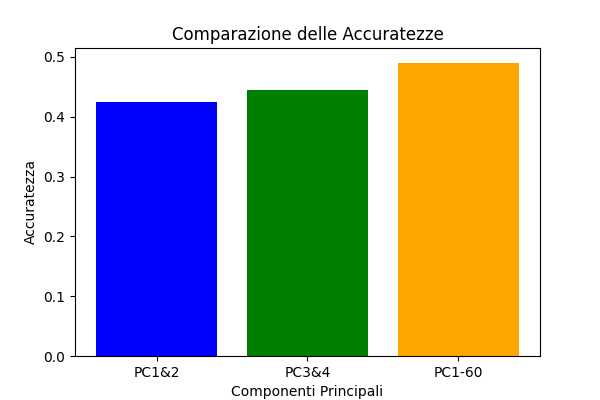
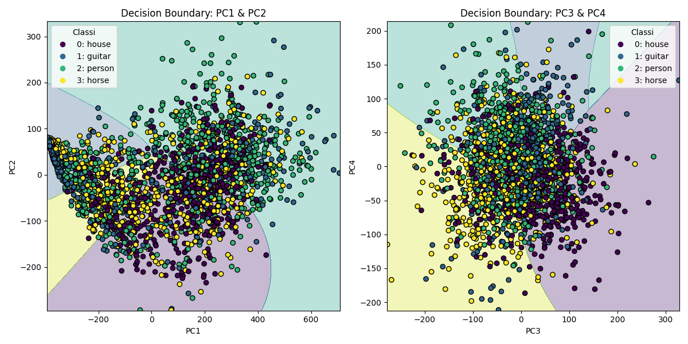

# PCA Analysis e Classificazione sul PACS Dataset

Questo progetto applica l'Analisi delle Componenti Principali (PCA) su un dataset di immagini scaricato da Hugging Face. L'obiettivo è ridurre la dimensionalità delle immagini, analizzare le componenti principali e utilizzare un classificatore Naive Bayes per valutare come la riduzione della dimensionalità influisca sulle performance di classificazione.

---

## **Dataset**
Il dataset utilizzato è il **PACS dataset**, scaricato da Hugging Face. È stato preprocessato per selezionare le 4 classi più bilanciate e salvato in un formato compatibile con Hugging Face.

Ogni immagine ha una dimensione originale di `227x227x3` (larghezza, altezza, canali RGB). Durante il preprocessing, tutte le immagini sono state appiattite in vettori monodimensionali di lunghezza `227x227x3 = 154587`. 

Questi vettori sono stati combinati per formare una matrice `X`, dove:
- **Le righe** rappresentano i campioni (una riga per ogni immagine).
- **Le colonne** rappresentano le feature (i pixel RGB appiattiti di ogni immagine).

Questa matrice `X` è stata utilizzata come input per l'analisi PCA.

---

## **Obiettivi**
1. **Riduzione della dimensionalità**: applicare PCA per ridurre la dimensionalità delle immagini.
2. **Visualizzazione delle componenti principali**: analizzare le prime componenti principali e la loro capacità di rappresentare i dati.
3. **Spiegabilità**: valutare la varianza spiegata cumulativa per determinare il numero ottimale di componenti principali.
4. **Classificazione**: valutare le performance di un classificatore Naive Bayes utilizzando diverse combinazioni di componenti principali.

---

## **Processo**
### **1. Preprocessing**
- Le immagini sono state standardizzate per avere media zero e varianza unitaria, un passaggio fondamentale per la PCA.
- È stata selezionata una singola immagine originale per confrontare i risultati della ricostruzione con diverse quantità di componenti principali.

### **2. PCA**
- La PCA è stata applicata per ridurre la dimensionalità dei dati.
- Sono state ricostruite immagini utilizzando:
  - Le prime 2 componenti principali.
  - Le prime 6 componenti principali.
  - Le prime 60 componenti principali.
  - Le ultime 6 componenti principali.

### **3. Visualizzazioni**
- **Scatter plot**: visualizzazione delle proiezioni delle immagini sulle componenti principali.
- **Varianza spiegata cumulativa**: analisi della quantità di varianza spiegata da un numero crescente di componenti principali.

### **4. Classificazione**
- Utilizzo di un classificatore Naive Bayes su diversi sottoinsiemi di componenti principali.
- Visualizzazione dei confini di decisione e confronto delle accuratezze.

---

## **Risultati**

### **1. Immagine originale**
L'immagine originale selezionata dal dataset è mostrata di seguito:


### **2. Immagini ricostruite**
Le immagini ricostruite utilizzando diverse quantità di componenti principali mostrano come la qualità della ricostruzione dipenda dal numero di componenti utilizzate:

- **2 Componenti principali**:
  
  - La ricostruzione è molto approssimativa, con perdita significativa di dettagli.

- **6 Componenti principali**:
  
  - La qualità migliora leggermente, ma i dettagli sono ancora limitati.

- **60 Componenti principali**:
  
  - La ricostruzione è molto più fedele all'immagine originale.

- **Ultime 6 Componenti principali**:
  
  - La ricostruzione è completamente distorta, poiché le ultime componenti principali catturano solo il rumore.

### **3. Scatter Plot**
Gli scatter plot mostrano la proiezione delle immagini sulle componenti principali. Ogni punto rappresenta un'immagine, colorata in base alla classe di appartenenza.

- **Prime due componenti principali (PC1 vs PC2)**:
  
  - Le prime due componenti principali catturano gran parte della struttura dei dati, separando parzialmente le classi.

- **Terza e quarta componente principale (PC3 vs PC4)**:
  
  - Le componenti successive catturano meno varianza e mostrano una separazione meno evidente.

- **Decima e undicesima componente principale (PC10 vs PC11)**:
  
  - Le componenti più alte catturano dettagli minori e non mostrano una chiara separazione tra le classi.

---

## **Classificazione con Naive Bayes**

### **Fondamento teorico**
Il classificatore Naive Bayes è un modello probabilistico basato sul **Teorema di Bayes**. La formulazione utilizzata è la seguente:

)

Dove:
- $\hat{y}$ è l'etichetta predetta.
- $k$ è il numero di classi.
- $x_1, \dots, x_d$ sono le feature di un esempio.
- $p(x \mid y)$ è modellato come una distribuzione **gaussiana**.
- La distribuzione delle etichette $p(y)$ è considerata uniforme.

In questo progetto, abbiamo utilizzato il classificatore **GaussianNB** di scikit-learn, che assume che le feature siano condizionatamente indipendenti e seguano una distribuzione normale.

---

### **Risultati della classificazione**

Le accuratezze ottenute con il classificatore Naive Bayes su diverse combinazioni di componenti principali sono:

| Componenti principali | Accuratezza |
|------------------------|-------------|
| PC1 & PC2             | **0.42**    |
| PC3 & PC4             | **0.46**    |
| PC1-60                | **0.49**    |



#### **Analisi delle performance**
- L'accuratezza **non supera il 50%** in nessuno dei tre scenari, nonostante la PCA catturi una parte significativa della varianza nei dati.
- Questo suggerisce che **la varianza catturata dalla PCA non coincide necessariamente con l'informazione discriminativa** necessaria per distinguere efficacemente tra le classi.
- È interessante notare che PC3 & PC4 ottengono risultati leggermente migliori di PC1 & PC2, indicando che le informazioni utili alla classificazione non sono concentrate esclusivamente nelle prime componenti principali.

#### **Possibili spiegazioni per le basse performance**
1. **Limitazioni del modello Naive Bayes**:
   - L'assunzione di indipendenza tra le feature spesso non è verificata nei dati reali.
   - La distribuzione gaussiana potrebbe non essere l'ideale per modellare la distribuzione delle componenti principali.

2. **Limitazioni della PCA**:
   - La PCA è una trasformazione lineare e potrebbe non catturare relazioni non lineari tra i pixel delle immagini.
   - Sebbene le componenti principali massimizzino la varianza, questa non è necessariamente correlata alla separabilità delle classi.

3. **Complessità intrinseca del dataset**:
   - Le immagini del PACS dataset contengono oggetti con variazioni significative di posa, illuminazione e contesto.
   - Quattro classi (house, guitar, person, horse) possono presentare somiglianze visive che rendono difficile la classificazione.

---

### **Decision Boundaries**
I confini di decisione del classificatore Naive Bayes sono visualizzati di seguito:



- A sinistra: confini di decisione utilizzando PC1 & PC2
- A destra: confini di decisione utilizzando PC3 & PC4

**Osservazioni**:
- I confini di decisione sono relativamente semplici, riflettendo la natura del classificatore Naive Bayes.
- La sovrapposizione significativa tra le classi in entrambi i grafici spiega le performance limitate del classificatore.
- La distribuzione dei punti e i confini di decisione mostrano come nessuno dei due piani (PC1-PC2 o PC3-PC4) offra una separazione ottimale delle classi.

---

### **Varianza spiegata cumulativa**
Il grafico della varianza spiegata cumulativa mostra quanta parte della varianza totale è spiegata da un numero crescente di componenti principali.


- **Osservazioni**:
  - Le prime poche componenti principali spiegano una grande parte della varianza totale.
  - Ad esempio, con circa 60 componenti principali, viene spiegata quasi tutta la varianza.
  - Questo dimostra che la PCA è efficace nel ridurre la dimensionalità mantenendo la maggior parte delle informazioni.

---

## **Conclusioni**
1. **Riduzione della dimensionalità**:
   - La PCA è stata in grado di ridurre significativamente la dimensionalità dei dati, mantenendo una buona qualità di ricostruzione con un numero limitato di componenti principali.

2. **Classificazione**:
   - Le prime componenti principali catturano la struttura globale dei dati, ma non sono sufficienti per una classificazione accurata.
   - L'aggiunta di componenti successive migliora leggermente le performance, ma è necessario un numero maggiore di componenti principali (es. 60) per ottenere risultati migliori.
   - I risultati mostrano che la varianza catturata dalla PCA non è necessariamente l'informazione più utile per la classificazione.

3. **Spiegabilità**:
   - Il grafico della varianza spiegata cumulativa fornisce una guida per scegliere il numero ottimale di componenti principali per la ricostruzione, ma non necessariamente per la classificazione.

4. **Miglioramenti possibili**:
   - Utilizzare classificatori più sofisticati come SVM, Random Forest o reti neurali.
   - Esplorare tecniche di riduzione della dimensionalità non lineari come t-SNE o UMAP.
   - Implementare tecniche di feature engineering specifiche per il dominio delle immagini.

---

## **Come eseguire il progetto**
1. Clona il repository:
   ```bash
   git clone https://github.com/Sere-eng/machine-learning.git
   cd machine-learning

2. Esegui lo script di preprocessing:
   ```bash
   python prepare_dataset.py

3. Esegui l'analisi PCA:
    ```bash
   python pca_analysis.py