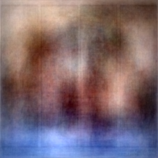
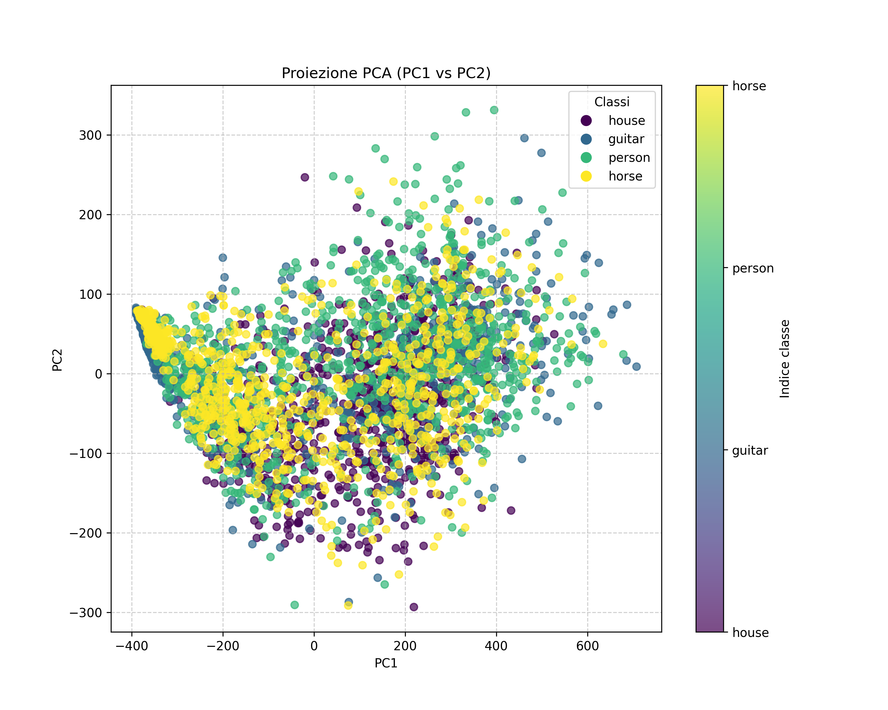
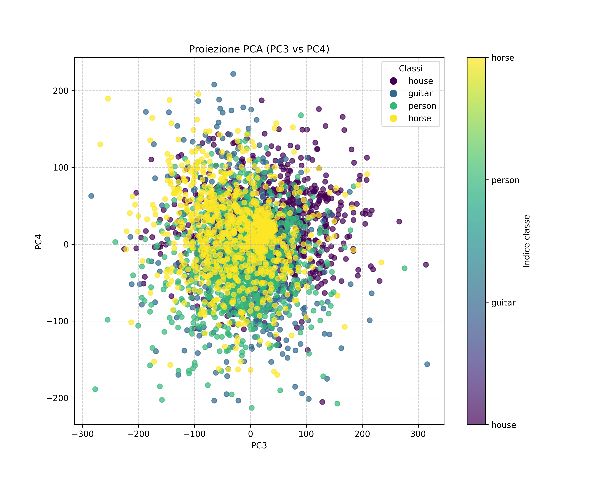
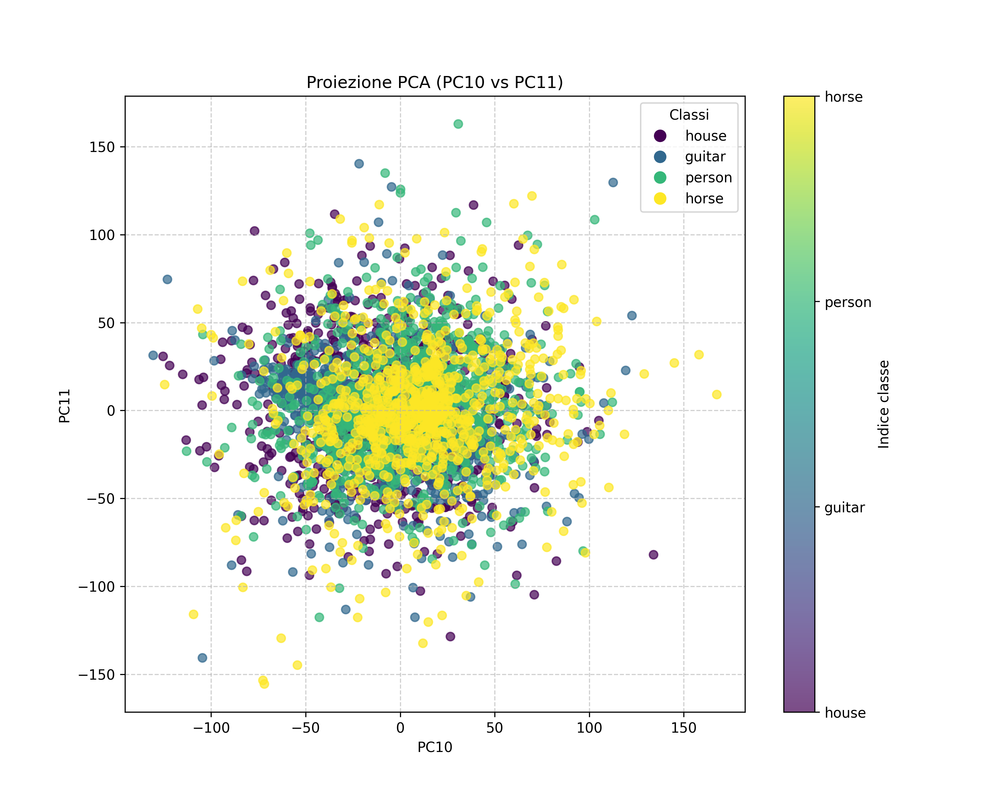

# PCA Analysis on Hugging Face Dataset

Questo progetto applica l'Analisi delle Componenti Principali (PCA) su un dataset di immagini scaricato da Hugging Face. L'obiettivo è ridurre la dimensionalità delle immagini, analizzare le componenti principali e visualizzare i risultati per comprendere meglio la struttura dei dati e l'importanza delle componenti principali.

---

## **Dataset**
Il dataset utilizzato è il **PACS dataset**, scaricato da Hugging Face. È stato preprocessato per selezionare le 4 classi più bilanciate e salvato in un formato compatibile con Hugging Face.

Ogni immagine ha una dimensione originale di `227x227x3` (larghezza, altezza, canali RGB). Durante il preprocessing, tutte le immagini sono state appiattite in vettori monodimensionali di lunghezza `227x227x3 = 154587`. 

Questi vettori sono stati combinati per formare una matrice `X`, dove:
- **Le righe** rappresentano i campioni (una riga per ogni immagine).
- **Le colonne** rappresentano le feature (i pixel RGB appiattiti di ogni immagine).

Questa matrice `X` è stata utilizzata come input per l'analisi PCA.

---

## **Obiettivi**
1. **Riduzione della dimensionalità**: applicare PCA per ridurre la dimensionalità delle immagini.
2. **Visualizzazione delle componenti principali**: analizzare le prime componenti principali e la loro capacità di rappresentare i dati.
3. **Spiegabilità**: valutare la varianza spiegata cumulativa per determinare il numero ottimale di componenti principali.

---

## **Processo**
### **1. Preprocessing**
- Le immagini sono state standardizzate per avere media zero e varianza unitaria, un passaggio fondamentale per la PCA.
- È stata selezionata una singola immagine originale per confrontare i risultati della ricostruzione con diverse quantità di componenti principali.

### **2. PCA**
- La PCA è stata applicata per ridurre la dimensionalità dei dati.
- Sono state ricostruite immagini utilizzando:
  - Le prime 2 componenti principali.
  - Le prime 6 componenti principali.
  - Le prime 60 componenti principali.
  - Le ultime 6 componenti principali.

### **3. Visualizzazioni**
- **Scatter plot**: visualizzazione delle proiezioni delle immagini sulle componenti principali.
- **Varianza spiegata cumulativa**: analisi della quantità di varianza spiegata da un numero crescente di componenti principali.

---

## **Risultati**

### **Immagine originale**
L'immagine originale selezionata dal dataset è mostrata di seguito:


---

### **Immagini ricostruite**
Le immagini ricostruite utilizzando diverse quantità di componenti principali mostrano come la qualità della ricostruzione dipenda dal numero di componenti utilizzate:

- **2 Componenti principali**:
  
  - La ricostruzione è molto approssimativa, con perdita significativa di dettagli.

- **6 Componenti principali**:
  
  - La qualità migliora leggermente, ma i dettagli sono ancora limitati.

- **60 Componenti principali**:
  
  - La ricostruzione è molto più fedele all'immagine originale.

- **Ultime 6 Componenti principali**:
  
  - La ricostruzione è completamente distorta, poiché le ultime componenti principali catturano solo il rumore.

---

### **Scatter Plot**
Gli scatter plot mostrano la proiezione delle immagini sulle componenti principali. Ogni punto rappresenta un'immagine, colorata in base alla classe di appartenenza.

- **Prime due componenti principali (PC1 vs PC2)**:
  
  - Le prime due componenti principali catturano gran parte della struttura dei dati, separando parzialmente le classi.

- **Terza e quarta componente principale (PC3 vs PC4)**:
  
  - Le componenti successive catturano meno varianza e mostrano una separazione meno evidente.

- **Decima e undicesima componente principale (PC10 vs PC11)**:
  
  - Le componenti più alte catturano dettagli minori e non mostrano una chiara separazione tra le classi.

---

### **Varianza spiegata cumulativa**
Il grafico della varianza spiegata cumulativa mostra quanta parte della varianza totale è spiegata da un numero crescente di componenti principali.


- **Osservazioni**:
  - Le prime poche componenti principali spiegano una grande parte della varianza totale.
  - Ad esempio, con circa 60 componenti principali, viene spiegata quasi tutta la varianza.
  - Questo dimostra che la PCA è efficace nel ridurre la dimensionalità mantenendo la maggior parte delle informazioni.

---

## **Conclusioni**
1. **Riduzione della dimensionalità**:
   - La PCA è stata in grado di ridurre significativamente la dimensionalità dei dati, mantenendo una buona qualità di ricostruzione con un numero limitato di componenti principali.

2. **Spiegabilità**:
   - Il grafico della varianza spiegata cumulativa fornisce una guida per scegliere il numero ottimale di componenti principali.

3. **Visualizzazione**:
   - Gli scatter plot mostrano come le prime componenti principali catturino la struttura dei dati, mentre le componenti successive catturano dettagli meno rilevanti o rumore.

---

## **Come eseguire il progetto**
1. Clona il repository:
   ```bash
   git clone https://github.com/Sere-eng/machine-learning.git
   cd machine-learning

2. Esegui lo script di preprocessing:
   ```bash
   python prepare_dataset.py

3. Esegui l'analisi PCA:
    ```bash
   python pca_analysis.py